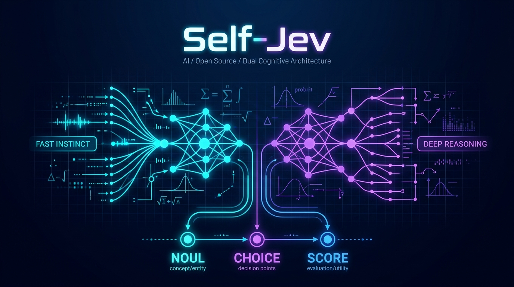
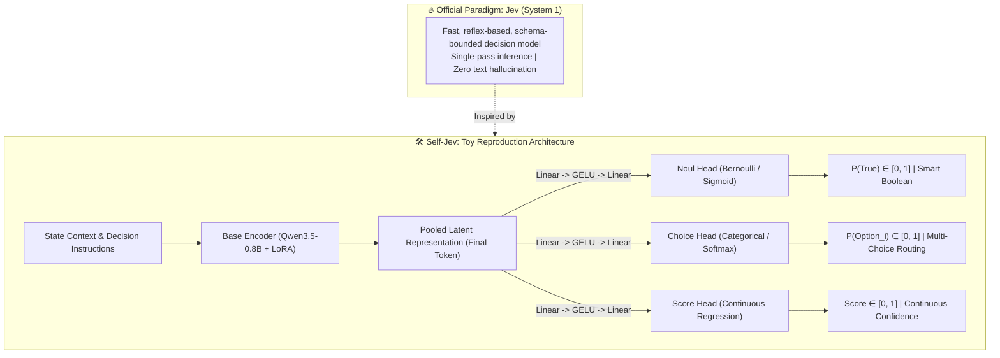

<p align="center">
  
</p>

<p align="center">
  <a href="https://github.com/relliex/self_jev/blob/main/LICENSE"></a>
  <a href="https://huggingface.co/Qwen"></a>
  
  <a href="https://pytorch.org/"></a>
  <a href="https://huggingface.co/Qwen/Qwen3.5-0.8B-Base"></a>
  <a href="https://github.com/huggingface/peft"></a>
  
  
</p>

<p align="center">
  <b>A lightweight, accessible DIY reproduction of the trending Jev "System 1" Decision Model.</b><br>
  <i>Exploring how to reproduce Jev's core mechanics (Noul, Choice, Score) using Qwen-0.8B, multi-task LoRA, and a consumer laptop GPU (< 4GB VRAM).</i>
</p>

<p align="center">
  <a href="README.md"><b>English</b></a> | <a href="README_zh.md"><b>中文文档</b></a>
</p>

---

> [!NOTE]
> **Community Project Disclaimer**:  
> **Jev** is a groundbreaking "System One" decision model released by **TypeSafe AI** that has recently gained tremendous popularity in the AI community.  
> This repository is a **personal, hobbyist-level proof-of-concept (PoC) exploration**. While its capabilities are naturally far from the official industrial model, this project demonstrates that **the underlying design intuition can be successfully reproduced with open-source tools on modest hardware**. I am sharing this engineering recipe with the open-source community to inspire anyone interested in tinkering with fast decision models!

---

## 💡 The Story Behind This Repo

Recently, Jev sparked widespread interest across the AI space. Unlike traditional large language models that generate text token-by-token, Jev operates as a **System One decision model**: it takes raw program state as input and returns typed, probabilistic decisions (`noul`, `choice`, `score`) in a single forward pass without hallucination.

As an AI enthusiast, I asked myself a simple question:  
👉 **"Can an individual developer replicate a similar effect on consumer hardware without massive compute?"**

During a weekend tinkering session, I tested an experimental recipe:
1. Took a lightweight, open-weight base model (`Qwen/Qwen3.5-0.8B-Base`);
2. Mounted three dedicated multi-task prediction heads (binary classification, categorical classification, and continuous regression);
3. Fine-tuned the representations using LoRA on three public benchmark datasets (`google/boolq`, `allenai/ai2_arc`, and `glue/stsb`) via free Google Colab T4 GPU;
4. Exported the checkpoint and deployed it locally on my laptop's entry-level **NVIDIA RTX 3050 (4GB VRAM)** via a FastAPI gateway conforming to the Jev API specification.

**The result? It actually worked!**  
The model runs at **< 15ms latency**, consumes **only ~2.2GB of VRAM**, never produces syntax formatting errors, and outputs clean probabilistic decisions. While its reasoning depth cannot compare with the official production Jev, the reproduction methodology itself is viable, elegant, and fun.

---

## 🎯 What This Project Is (and Isn't)

- ✅ **A Minimalist Proof of Concept**: Demonstrates how to bypass autoregressive decoding and turn a language model into a fast decision engine.
- ✅ **A Reproducible DIY Recipe**: Complete, verified steps from cloud Colab training to local Windows/Linux serving.
- ✅ **100% Consumer-Friendly**: Requires zero expensive cloud GPUs. Runs smoothly on a 4GB VRAM laptop GPU.
- ❌ **NOT an Official Replacement**: We do not claim parity with the official Jev model, which is trained on massive calibrated datasets with RLCD.
- ❌ **NOT a General Chatbot**: It does not generate freeform conversational text.

---

## 📐 Architecture & The Three Primitives



### The Three Decision Primitives

| Primitive | Mathematical Nature | Output Format | Mapped Dataset in PoC | Primary Role in Agentic Systems |
| :--- | :--- | :--- | :--- | :--- |
| **`noul`** | Bernoulli Trial | Probability $p \in [0, 1]$ & `true/false` | `google/boolq` | Yes/No gate, safety filter, fact assertion |
| **`choice`** | Categorical Softmax | Winner option & full probability map | `allenai/ai2_arc` | Intent classification, agent tool routing |
| **`score`** | Continuous Metric | Normalized scalar $s \in [0, 1]$ | `nyu-mll/glue (stsb)` | Semantic relevance ranking, response scoring |

---

## ⚡ Performance: Fast Reflex vs. Slow Generation

Why does the "System One" decision approach feel so fast?

| Comparison Point | Autoregressive LLM (e.g. 8B with JSON Mode) | Self-Jev Toy Model (Qwen-0.8B + MLP Heads) |
| :--- | :--- | :--- |
| **Decoding Step** | Autoregressive loop ($O(N)$ token steps) | Single forward pass ($O(1)$ pooled matrix multiplication) |
| **Observed Latency** | $800 \text{ ms} \sim 2,500 \text{ ms}$ | **$8 \text{ ms} \sim 15 \text{ ms}$** |
| **Type Consistency** | May output Markdown fences or syntax errors | Guaranteed valid types (pure numerical tensors) |
| **Inference VRAM** | $8\text{GB} \sim 16\text{GB}$ | **$\approx 2.2 \text{GB}$ (FP16)** |
| **Serving Hardware** | Mid/High-tier GPU or Cloud API | Entry-level laptop GPU (RTX 3050 Laptop / 4GB) |

---

## 🖥️ Hardware Requirements & VRAM Guide

A critical engineering insight from hands-on experiments: **Training VRAM demands are significantly higher than Inference!**

| Mode | Recommended Hardware | Peak VRAM | Notes & Pitfalls |
| :--- | :--- | :--- | :--- |
| **Local Inference** | **Laptop RTX 3050 (4GB)** <br>or any entry-level GPU | **~2.2 GB (FP16)** | **Runs effortlessly**: With `torch.no_grad()` and no KV cache, 4GB laptop GPUs run the gateway continuously with zero pressure. |
| **Cloud Training** | **Google Colab T4 (Free)** <br>15GB VRAM | **~6.8 GB** | **🌟 Recommended Path**: Linux headless environment has 0 desktop overhead, effortlessly absorbing the ~7GB training peak for free. |
| **Local Windows Training** | **RTX 3060 12G / 4070 12G+** <br>(Recommended $\ge$ 11GB) | **~7GB + OS Overhead** <br>(Total $\approx$ 9 ~ 10GB) | **⚠️ Watch Out**: Windows Desktop Window Manager (DWM), browsers, and background apps routinely eat 1.5 ~ 2.5GB VRAM. An 8GB card will easily hit CUDA OOM! If training on an 8GB GPU, you must reduce `BATCH_SIZE=1` and use 8-bit AdamW. |

---

## 🚀 Step-by-Step Reproduction SOP

### Stage 1: Model Training (Choose Cloud or Local)

You have two options for training. **Option A is strongly recommended and verified in practice.**

---

#### 🌟 Option A: Google Colab T4 (Recommended & Verified in Practice ✅)

> [!TIP]
> **Verified in Practice**: This workflow has been fully tested and validated in practice. Because Google Colab provides a dedicated 15GB T4 GPU in a clean headless Linux environment, it effortlessly handles the ~6.8GB peak VRAM without any desktop OS interference. Training finishes in ~15 minutes with early stopping.

1. Open [Google Colab](https://colab.research.google.com/) and create a new notebook.
2. Under **Runtime** -> **Change runtime type**, select **T4 GPU**.
3. Install training dependencies:
   ```bash
   !pip install -q transformers datasets accelerate peft bitsandbytes scikit-learn torchao
   ```
4. Copy and run the complete multi-task script from [`training_code/main.py`](./training_code/main.py).
   * Automatically prepares balanced subsets of BoolQ, ARC-Easy, and STS-B;
   * Injects LoRA adapters into `Qwen/Qwen3.5-0.8B-Base`;
   * Trains all three heads with **validation loss checks and early stopping every 50 steps**;
   * Exports the best checkpoint to `jev_tri_primitive_real/jev_best_checkpoint.pt`.
5. Download the trained checkpoint:
   ```python
   !zip -r jev_tri_primitive_real.zip jev_tri_primitive_real
   from google.colab import files
   files.download("jev_tri_primitive_real.zip")
   ```

---

#### 💻 Option B: Local Machine Training (For GPUs with $\ge$ 12GB VRAM)

If you have a sufficiently powerful local GPU (e.g., RTX 3060 12GB, RTX 4070 12GB, or a Linux workstation), you can train directly on your machine. The execution logic is identical to Colab:

1. **Create and activate an isolated environment** (Supports Python 3.10 ~ 3.13, tested on 3.13.3):
   * *Via Conda*:
     ```bash
     conda create -n jev_train python=3.13 -y
     conda activate jev_train
     ```
   * *Or via native Python `venv`*:
     ```bash
     python -m venv .venv
     .venv\Scripts\activate   # On Windows
     # source .venv/bin/activate # On Linux
     ```
2. **Install PyTorch with CUDA acceleration (CUDA 12.6 / 12.4)**:
   ```bash
   # PyTorch official wheel for Python 3.13 with CUDA 12.6
   pip install torch torchvision torchaudio --index-url https://download.pytorch.org/whl/cu126
   ```
   *(Note: If your system uses CUDA 12.4 or 12.1, simply substitute `cu124` or `cu121` into the index URL.)*
3. **Install training requirements**:
   ```bash
   pip install -r requirements.txt
   pip install torchao
   ```
4. **(Windows Only) Free VRAM**:
   Close heavy browser tabs (Chrome/Edge with hardware acceleration) and background apps to free up 1.5 ~ 2.5GB of video memory.
5. **Run training**:
   ```bash
   python training_code/main.py
   ```
   The script will monitor the validation pool every 50 steps and save the best checkpoint to `jev_tri_primitive_real/jev_best_checkpoint.pt`.
6. **Move checkpoint for deployment**:
   ```bash
   # Copy the best checkpoint to the project root directory
   cp jev_tri_primitive_real/jev_best_checkpoint.pt .
   ```

---

### Stage 2: Local Deployment (Windows + RTX 3050 Laptop)

> [!TIP]
> **Verified in Practice**:
> * OS: Windows 11
> * Python: **3.13.3**
> * GPU: **NVIDIA GeForce RTX 3050 Laptop GPU (4GB VRAM)**
> * Driver: **616.92 (CUDA 12.6 / 13.x compatible)**

1. **Create/Activate Environment**:
   ```cmd
   conda create -n myjev python=3.13 -y
   conda activate myjev
   ```
   *(Or reuse an existing Python 3.13 virtual environment).*
2. **Install GPU PyTorch (CUDA 12.6 / 12.4)**:
   ```cmd
   pip install torch torchvision torchaudio --index-url https://download.pytorch.org/whl/cu126
   ```
   **Verify GPU Detection**:
   ```cmd
   python -c "import torch; print('CUDA Available:', torch.cuda.is_available()); print('Device:', torch.cuda.get_device_name(0))"
   ```
3. **Install Gateway Dependencies**:
   ```cmd
   pip install -r requirements.txt
   ```
4. **Start the Local Gateway**:
   Place `jev_best_checkpoint.pt` in the project root and launch:
   ```cmd
   python jev_server.py
   ```
   Terminal output will confirm:
   ```text
   [INFO] Local Jev System One Gateway operational on http://127.0.0.1:8000/v1/systemone
   ```

---

## 🔌 API Testing (`POST /v1/systemone`)

Send a test payload using `curl` or Postman:

```bash
curl -X POST http://127.0.0.1:8000/v1/systemone \
  -H "Content-Type: application/json" \
  -d '{
    "model": "jev-latest",
    "state": "During photosynthesis, plants absorb carbon dioxide and water to produce glucose and release gas.",
    "questions": {
      "gas_selection": {
        "type": "choice",
        "instructions": "Which gas is primarily released?",
        "criteria": ["A: Nitrogen", "B: Oxygen", "C: Hydrogen", "D: Chlorine"]
      },
      "is_oxygen": {
        "type": "noul",
        "instructions": "Is the released gas oxygen?"
      }
    }
  }'
```

**Returned Result**:
```json
{
  "model": "jev-latest",
  "results": {
    "gas_selection": {
      "type": "choice",
      "choice": "B: Oxygen",
      "probabilities": {
        "A: Nitrogen": 0.0002,
        "B: Oxygen": 0.9976,
        "C: Hydrogen": 0.0015,
        "D: Chlorine": 0.0007
      },
      "confidence": 0.9976
    },
    "is_oxygen": {
      "type": "noul",
      "noul": 0.9951,
      "result": true
    }
  }
}
```

---

## 📂 Repository Layout

```text
self_jev/
├── assets/
│   └── banner.png                # Architecture visual banner
├── training_code/
│   └── main.py                   # Multi-task training script with early stopping
├── jev_server.py                 # FastAPI System One gateway
├── requirements.txt              # Dependency specifications
├── LICENSE                       # MIT License
├── README.md                     # English documentation
└── README_zh.md                  # Chinese documentation
```

---

## 🤝 Community & Discussion

This is an open, exploratory project. If you have ideas on:
- Trying different lightweight base models (e.g. SmolLM, Llama-3.2-1B);
- Refining dataset mixture ratios or adding domain-specific decision datasets;
- Exploring calibration techniques (temperature scaling, RLCD approximations);

Feel free to open an issue or submit a pull request! ⭐ If this replication idea inspired your own experiments, please consider starring this repository!

---

## 📜 License & Compliance

### 1. Dual Licensing (Code vs. Weights)
- **Source Code**: All original code, scripts, gateways, and documentation in this repository are released under the [MIT License](LICENSE).
- **Model Checkpoints**: Any fine-tuned model checkpoints are derived from Alibaba Cloud's [Qwen3.5-0.8B-Base](https://huggingface.co/Qwen) and are distributed under the terms of the **[Apache License 2.0](https://www.apache.org/licenses/LICENSE-2.0)**. Users must adhere to the base model's open-source terms and licensing constraints.

### 2. Attribution & Acknowledgments
- **TypeSafe AI**: "Jev" is developed by TypeSafe AI. `self_jev` is an independent, open-source educational proof-of-concept (PoC) and is not affiliated with, sponsored by, or endorsed by TypeSafe AI.
- **Alibaba Cloud Qwen Team**: We gratefully thank the Qwen team for open-sourcing the high-performance Qwen series under permissive licensing.
- **Academic Benchmark Datasets**: We acknowledge the creators of the datasets used in this educational demonstration:
  - `google/boolq` (Clark et al., Google Research)
  - `allenai/ai2_arc` (Clark et al., Allen Institute for AI)
  - `nyu-mll/glue (stsb)` (Wang et al., NYU / GLUE Consortium)

### 3. Ethical & Responsible AI Use Disclaimer
This project is an experimental demonstration trained on limited benchmark subsets. It is intended purely for research, architectural exploration, and educational exchange. It should **not** be deployed for high-stakes, safety-critical, legal, medical, or life-impacting decision-making without independent verification and human oversight. The author is not liable for any direct or indirect consequences arising from the use or misuse of this software or associated weights.
