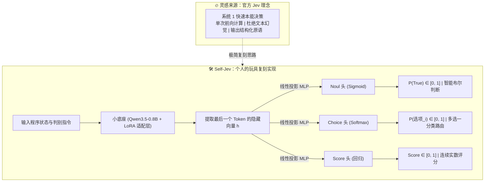

<p align="center">
  
</p>

<p align="center">
  <a href="https://github.com/relliex/self_jev/blob/main/LICENSE"></a>
  
  <a href="https://pytorch.org/"></a>
  <a href="https://huggingface.co/Qwen/Qwen3.5-0.8B-Base"></a>
  <a href="https://github.com/huggingface/peft"></a>
  
  
</p>

<p align="center">
  <b>个人玩耍复刻火爆的 Jev 模型！分享一种在消费级显卡（< 4GB）上手搓“系统 1”决策模型的极简思路。</b><br>
  <i>用 Qwen-0.8B + 多任务 LoRA，在免费 Colab 与 RTX 3050 笔记本上复刻出类似 Noul、Choice、Score 的决策效果。</i>
</p>

<p align="center">
  <a href="README.md"><b>English</b></a> | <a href="README_zh.md"><b>中文文档</b></a>
</p>

---

> [!NOTE]
> **声明与致敬**：  
> **Jev** 是由 **TypeSafe AI** 发布的全新“系统 1（System One）”结构化决策模型，最近在 AI 圈和开源社区非常火爆。  
> 本项目纯属**个人业余玩耍时的玩具级概念复刻（Proof-of-Concept）**。模型的能力和校准度**远远不及官方工业级 Jev**，但我发现仅通过简单的开源工具链和轻量底座，就能在个人笔记本上复刻出非常相似的决策机制与接口体验。我认为这套复刻思路很有意思且门槛极低，因此整理开源出来与社区朋友们共同交流！

---

## 💡 这个项目从何而来？

最近看到很多人在讨论 Jev：大家发现它不像传统的大语言模型那样逐字蹦 Token，而是专门做**确定性结构化决策**——输入程序状态，单次前向传播直接吐出概率化的三大原语（`noul`、`choice`、`score`），既快又没有幻觉。

作为一个 AI 爱好者，在被这个理念惊艳到的同时，我也很好奇：  
👉 **“普通人能不能用手里仅有的几张小卡（甚至笔记本电脑），自己复刻一个类似机制的 mini 版玩一玩？”**

于是我动手做了一个简单实验：
1. 找一个非常轻量且语义理解优秀的开源小底座：`Qwen/Qwen3.5-0.8B-Base`；
2. 不让它做自回归生成，而是在它最后一个 Token 的隐藏状态上外挂了 3 个轻量级分类/回归头；
3. 用公开的基础数据集做多任务映射（`google/boolq` 对应智能布尔 Noul、`allenai/ai2_arc` 对应多选题 Choice、`glue/stsb` 对应打分 Score）；
4. 在免费的 Google Colab T4 上挂上 LoRA 跑了个混合微调（带验证集早停）；
5. 导出权重，在自己的轻薄本显卡 **RTX 3050 Laptop（仅 4GB 显存）** 上用 FastAPI 写了个符合 Jev 标准规范的 `/v1/systemone` 网关。

**跑通之后的效果让我很惊喜！**  
推理耗时只需 **十几毫秒**，显存常驻仅 **2.2 GB**，输出结果完全结构化、无幻觉。虽然它的复杂常识深度远远比不上官方大厂训练的真实 Jev，但**这套复刻思路证明了：普通开发者完全可以用极低的成本，做出具备类似行为的专用决策模型**。

---

## 🎯 项目定位（我们做到了什么，没做什么）

- ✅ **极简的机制复刻（PoC）**：验证了“丢弃自回归解码、改用隐藏层特征池化做决策输出”的可行性。
- ✅ **完全可复现的完整链路**：从云端 0 元训练、早停防过拟合，到本地 4GB 笔记本 GPU 常驻服务启动。
- ✅ **低门槛与平民化**：不需要几十上百张 A100/H100，4GB 显存即可完整跑通。
- ❌ **并非官方 Jev 的替代品**：官方 Jev 是经过数百万级专业数据集与 RLCD（强化学习标定决策）训练出来的工业级产品，本项目仅供学习与玩法探索。
- ❌ **不是聊天机器人**：它不负责长文本对话或创意生成。

---

## 📐 架构思路与三大决策原语



### 三大原语在复刻版中的映射方案

| 原语名称 | 它的作用 | 输出数据 | 在我的实验中所用公开数据集 | 在日常程序/智能体里的场景 |
| :--- | :--- | :--- | :--- | :--- |
| **`noul`** | **智能布尔值** | 0~1 的概率值与 True/False | `google/boolq`（是非阅读理解） | 安全守卫、事实核验、分支条件门控 |
| **`choice`** | **多项选择分类** | 获胜选项及每一项的概率分布 | `allenai/ai2_arc`（单选推理题） | 智能体工具分发、用户意图路由 |
| **`score`** | **连续评分打分** | 0.0 ~ 1.0 的连续标量值 | `nyu-mll/glue (stsb)`（语义相似度打分） | 检索段落重排序（Rerank）、质量评价 |

---

## ⚡ 体验对比：为什么比普通 LLM 快得多？

| 对比维度 | 普通大模型（如 8B 模型跑 JSON 格式输出） | Self-Jev 玩具模型（0.8B + 线性头直出） |
| :--- | :--- | :--- |
| **计算流程** | 逐 Token 循环解码（几十次 Forward） | **单次前向特征计算（仅 1 次 Forward）** |
| **端到端耗时** | 800ms ~ 3000ms | **8ms ~ 15ms（快几十倍到上百倍）** |
| **格式问题** | 可能夹带 Markdown 或多余符号导致 JSON 解析崩溃 | **强类型张量输出，永远不会解析失败** |
| **推理显存** | 8GB ~ 16GB | **仅约 2.2GB（FP16）** |
| **部署硬件** | 较重型硬件或收费 API | 消费级游戏本独显（RTX 3050 Laptop / 4GB 等） |

---

## 🖥️ 硬件要求与显存避坑指南（实测踩坑心得）

在尝试复刻前，请务必注意**“训练阶段”**与**“推理阶段”**对显存的巨大需求差异：

| 任务场景 | 推荐硬件环境 | 实际显存峰值 | 关键避坑提醒 |
| :--- | :--- | :--- | :--- |
| **端侧常驻推理** <br>(Inference) | **笔记本 RTX 3050 (4GB)** <br>或任意消费级独显 | **~2.2 GB (FP16)** | **极度轻量**：推理开启了 `torch.no_grad()`，无需优化器和反向传播图，4GB 显存轻薄本常驻后台毫无压力。 |
| **云端微调训练** <br>(Colab Training) | **Google Colab (免费 T4)** <br>分配显存 15GB | **~6.8 GB** | **🌟 强烈推荐默认路径**：Linux 无头环境原生显存占用为 0，白嫖 15GB 显存可轻松容纳 ~7GB 的训练峰值，杜绝爆显存。 |
| **本地 Windows 训练** <br>(Local Training) | **RTX 3060 12G / 4070 12G+** <br>建议显存 $\ge$ 11GB | **~7GB + 桌面系统占用** <br>(总计需 9 ~ 10GB 显存) | **⚠️ 避坑预警**：Windows 桌面窗口管理器（DWM）、浏览器、后台软件常驻吃掉 1.5~2.5GB 显存。在 8GB 显卡上本地跑训练极易遭遇 `CUDA OOM`！若执意在 8GB 卡跑训练，需将 `BATCH_SIZE` 降为 1 并改用 8-bit AdamW。 |

---

## 🚀 手把手复刻指南（SOP）

### 阶段一：模型微调训练（云端或本地双路线）

训练提供了两条路线。**强烈推荐路线 A（本项目已实践可用）**。

---

#### 🌟 路线 A：Google Colab 免费 T4 云端微调（推荐 & 本项目已实践可用 ✅）

> [!TIP]
> **本项目已实践可用**：该路线已全流程跑通、验证早停机制并成功导出权重。由于 Colab 提供了纯净无桌面占用的 15GB T4 GPU，可零成本轻松容纳 ~6.8GB 的训练显存峰值，耗时约 15 分钟即可自动早停并输出最优权重。

1. 浏览器访问 [Google Colab](https://colab.research.google.com/) 并新建笔记本。
2. 顶部菜单选择：**代码执行程序** -> **更改运行时类型** -> 选择 **T4 GPU**。
3. 安装训练依赖：
   ```bash
   !pip install -q transformers datasets accelerate peft bitsandbytes scikit-learn torchao
   ```
4. 贴入并运行 [`training_code/main.py`](./training_code/main.py) 中的完整训练代码。
   * 脚本会自动从 HuggingFace 拉取 BoolQ、ARC、STS-B 组装多任务数据池；
   * 为 Qwen3.5-0.8B 挂上 LoRA 适配层并绑定 3 个决策头；
   * 开启混合精度训练，**每 50 步进行验证集体检，自带早停熔断**；
   * 自动将最优检查点保存至 `jev_tri_primitive_real/jev_best_checkpoint.pt`。
5. 压缩并下载模型权重：
   ```python
   !zip -r jev_tri_primitive_real.zip jev_tri_primitive_real
   from google.colab import files
   files.download("jev_tri_primitive_real.zip")
   ```

---

#### 💻 路线 B：本地电脑训练（适合显存 $\ge$ 12GB 的显卡）

如果你的电脑拥有较充裕的显存（如 RTX 3060 12GB、RTX 4070 12GB+ 或 Linux 工作站），你也可以直接在本地执行训练，其底层代码逻辑与云端完全一致：

1. **创建并激活独立 Python 环境**（全面支持 Python 3.10 ~ 3.13，实测 3.13.3）：
   * *使用 Conda*：
     ```cmd
     conda create -n jev_train python=3.13 -y
     conda activate jev_train
     ```
   * *或直接使用原生 Python `venv`*：
     ```cmd
     python -m venv .venv
     .venv\Scripts\activate
     ```
2. **安装专有 CUDA 版 PyTorch（推荐 CUDA 12.6 / 12.4 专有源）**：
   ```cmd
   # 针对 Python 3.13 及较新 NVIDIA 显卡驱动的官方 CUDA 12.6 轮子
   pip install torch torchvision torchaudio --index-url https://download.pytorch.org/whl/cu126
   ```
   *(注：如果你本地驱动偏好 CUDA 12.4 或 12.1，只需将链接末尾替换为 `cu124` 或 `cu121` 即可。)*
3. **安装训练依赖**：
   ```cmd
   pip install -r requirements.txt
   pip install torchao
   ```
4. **（Windows 用户推荐）释放显存**：
   关闭开启硬件加速的 Chrome/Edge 浏览器标签页、游戏及多余后台，释放出 1.5GB ~ 2.5GB 宝贵的系统显存。
5. **启动本地训练**：
   ```cmd
   python training_code/main.py
   ```
   脚本会每 50 步体检验证集并在达到早停条件后自动停止，最优权重存放在 `jev_tri_primitive_real/jev_best_checkpoint.pt`。
6. **将权重复制至项目根目录准备部署**：
   ```cmd
   copy jev_tri_primitive_real\jev_best_checkpoint.pt .
   ```

---

### 阶段二：本地端侧部署（Windows + RTX 3050 Laptop）

> [!TIP]
> **本项目已实践可用**：
> * 操作系统：Windows 11
> * Python 版本：**3.13.3**
> * 独立显卡：**NVIDIA GeForce RTX 3050 Laptop GPU（4GB 显存）**
> * 驱动版本：**616.92（完全兼容 CUDA 12.6 / 13.x 运行时）**

1. **创建或激活 Python 3.13 环境**：
   ```cmd
   conda create -n myjev python=3.13 -y
   conda activate myjev
   ```
   *(或者直接在原生 Python 3.13 虚拟环境中运行)。*
2. **安装专有 CUDA 版 PyTorch（CUDA 12.6 / 12.4）**：
   ```cmd
   pip install torch torchvision torchaudio --index-url https://download.pytorch.org/whl/cu126
   ```
   **执行显卡调用验证**：
   ```cmd
   python -c "import torch; print('CUDA Available:', torch.cuda.is_available()); print('Device:', torch.cuda.get_device_name(0))"
   ```
3. **安装网关依赖**：
   ```cmd
   pip install -r requirements.txt
   ```
4. **启动服务**：
   将下载好的 `jev_best_checkpoint.pt` 放到项目根目录下，直接运行：
   ```cmd
   python jev_server.py
   ```
   终端显示：
   ```text
   [INFO] Local Jev System One Gateway operational on http://127.0.0.1:8000/v1/systemone
   ```

---

## 🔌 模拟 Jev 接口调用测试

打开终端发起调用测试：

```bash
curl -X POST http://127.0.0.1:8000/v1/systemone \
  -H "Content-Type: application/json" \
  -d '{
    "model": "jev-latest",
    "state": "在植物光合作用过程中，植物吸收二氧化碳和水，并在光照条件下释放气体并生成葡萄糖。",
    "questions": {
      "gas_selection": {
        "type": "choice",
        "instructions": "主要释放出哪种气体？",
        "criteria": ["A: 氮气", "B: 氧气", "C: 氢气", "D: 氯气"]
      },
      "is_oxygen": {
        "type": "noul",
        "instructions": "释放的气体是否为氧气？"
      }
    }
  }'
```

**响应结果**：
```json
{
  "model": "jev-latest",
  "results": {
    "gas_selection": {
      "type": "choice",
      "choice": "B: 氧气",
      "probabilities": {
        "A: 氮气": 0.0002,
        "B: 氧气": 0.9976,
        "C: 氢气": 0.0015,
        "D: 氯气": 0.0007
      },
      "confidence": 0.9976
    },
    "is_oxygen": {
      "type": "noul",
      "noul": 0.9951,
      "result": true
    }
  }
}
```

---

## 📂 项目文件说明

```text
self_jev/
├── assets/
│   └── banner.png                # 架构示意图横幅
├── training_code/
│   └── main.py                   # 云端多任务训练与早停脚本
├── jev_server.py                 # 本地 FastAPI 决策网关
├── requirements.txt              # 项目依赖
├── LICENSE                       # MIT 开源协议
├── README.md                     # 英文主文档
└── README_zh.md                  # 中文主文档
```

---

## 🤝 欢迎交流与探讨

这个项目是个人的一次好奇心探索与玩法分享。如果你对以下方向感兴趣，欢迎提 Issue 或 PR 一起玩：
- 换用其他小底座（如 SmolLM、Llama-3.2-1B、Gemma-2B）做对比；
- 扩展更多专业领域的决策训练集；
- 尝试简单的温度缩放（Temperature Scaling）来提高预测概率的置信度校准。

如果这套复刻思路对你有哪怕一点点启发，欢迎给个 Star ⭐ 鼓励一下！

---

## 📜 开源协议

[MIT License](LICENSE)
